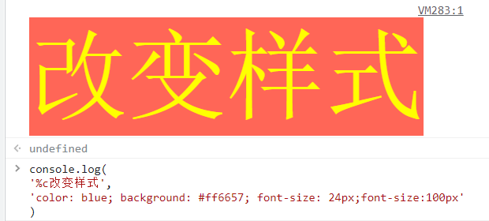
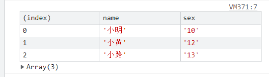
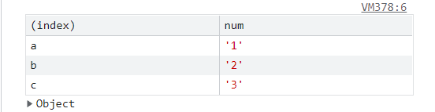
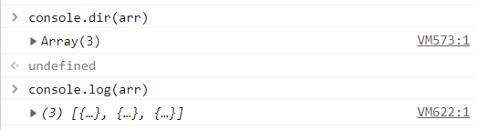
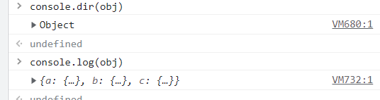
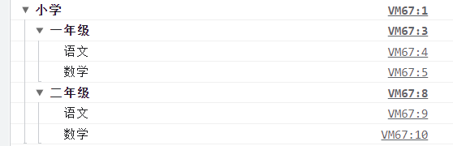
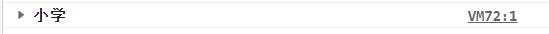
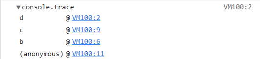
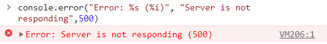
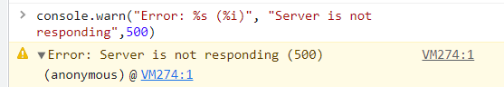

## 2.0 console的几个常用方法

>Console 对象用于 JavaScript 调试。
> JavaScript 原生中默认是没有 Console 对象，这是宿主对象（也就是浏览器）提供的内置对象。 用于访问调试控制台, 在不同的浏览器里效果可能不同

## 1.0 console.log

>输出信息。高级用法修改样式
 
```
console.log('message') //message
// 修改样式 添加%c
console.log('%c欢迎您的到来','color:red;')
console.log(
'%c改变样式',
'color: yellow; background: #ff6657; font-size: 24px;font-size:100px'
)

```
<br>

## 2.0 console.info

>用法跟log一样，就不过多解释了

## 3.0 console.table

>将复合类型的数据转为表格显示。

```angular2html
var students = [
    { name: "小明", sex: "10" },
    { name: "小黄", sex: "12" },
    { name: "小路", sex: "13" }
];
console.table(students);
```
<br>

```angular2html
var obj= {
        a:{ num: "1"},
        b:{ num: "2"},
        c:{ num: "3" }
        };
console.table(obj);
```
<br>

## 4.0 console.count()
>用于计数，输出它被调用了多少次。

``` 
(function() {
  for (var i = 0; i < 5; i++) { 
    console.count('count'); 
  }
})();
// 打印
count: 1
count: 2
count: 3
count: 4
count: 5
```

## 5.0 console.dir()
>以便于阅读的形式输出打印内容

```angular2html
var arr= [
         { num: "1"},
         { num: "2"}, 
         { num: "3" }
    ];
```
<br>
```angular2html
var obj= {
        a:{ num: "1"},
        b:{ num: "2"},
        c:{ num: "3" }
  };
```
<br>

## 6.0 console.time() 和 console.endTime()
>统计程序执行的时间

```     
console.time('array');

var array= new Array(1000000);
for (var i = array.length - 1; i >= 0; i--) {
  array[i] = new Object();
};

console.timeEnd('array');
// 打印
array: 131.55419921875 ms
```

## 7.0 console.group() 与 groupEnd() 与 groupCollapsed()
>group: 用于将显示的信息分组，可以把信息进行折叠和展开。<br>
>groupEnd: 结束内联分组 <br>
>groupCollapsed: 与console.group方法很类似，唯一的区别是该组的内容，在第一次显示时是收起的（collapsed），而不是展开的。

``` 
    console.group("小学")
    // 内部嵌套
        console.group("一年级")
            console.log("语文")
            console.log("数学")
        console.groupEnd()
    //内部嵌套
        console.group("二年级")
            console.log("语文")
            console.log("数学")
        console.groupEnd()
    console.groupEnd()
```
<br>
``` 
    console.groupCollapsed("小学")
    // 内部嵌套
        console.groupCollapsed("一年级")
            console.log("语文")
            console.log("数学")
        console.groupEnd()
    //内部嵌套
        console.groupCollapsed("二年级")
            console.log("语文")
            console.log("数学")
        console.groupEnd()
    console.groupEnd()
```
<br>

## 8.0 console.trace()
>追踪函数的调用过程

```angular2html
    function d(a) { 
      console.trace();
      return a;
    }
    function b(a) { 
      return c(a);
    }
    function c(a) { 
      return d(a);
    }
    var a = b('123');

```
<br>

## 9.0 console.assert()
>assert方法接受两个参数，第一个参数是表达式，第二个参数是字符串。只有当第一个参数为false，才会输出第二个参数，否则不会有任何结果。

```angular2html
console.assert(true === false, "判断条件不成立")
// 输出 判断条件不成立

console.assert(true, '判断条件不成立')
// 没有任何输出
```

## 10.0 console.error()
>输出信息时，在最前面加一个红色的叉，表示出错，同时会显示错误发生的堆栈。

```angular2html
console.error("Error: %s (%i)", "Server is not responding",500)

注意：这些引用类型应该是（％s = string，％i = integer，％o = object，％f = float）
```
<br>

## 11.0 console.warn()
>输出警告信息 用法同error 类似

```angular2html
console.error("Error: %s (%i)", "Server is not responding",500)
```
<br>
