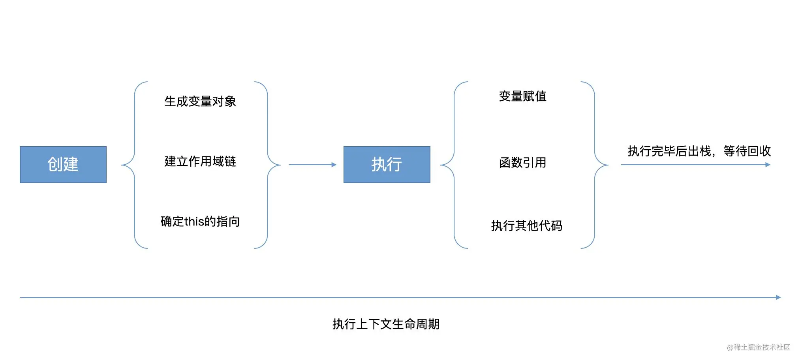

## 8.0 执行上下文和执行栈

**什么是执行上下文？**

Javascript 代码都是在执行上下文中运行的
<br>

执行上下文： 指当前执行环境中的变量、函数声明、作用域链、this等信息
<br>

其实也可以理解为，执行上下文就是作用域

**执行上下文生命周期**
<br>
1. 创建阶段 <br>
生成变量对象、建立作用域链、确定this的指向

2. 执行阶段 <br>
变量赋值、函数的引用、执行其他代码
<br>

**变量对象**

变量对象是与执行上下文相关的数据作用域，存储了上下文中定义的变量和函数声明
<br>

变量对象是一个抽象的概念，在全局执行上下文中，变量对象就是全局对象。 在顶层js代码中，this指向全局对象，全局变量会作为该对象的属性来被查询。在浏览器中，window就是全局对象

**执行栈**

是一种**先进后出**的数据结构，用来存储代码运行的所有执行上下文<br>

1. 当 JS 引擎第一次遇到js脚本时，会创建一个全局的执行上下文并且压入当前执行栈<br>
2. 每当JS 引擎遇到一个函数调用，它会为该函数创建一个新的执行上下文并压入栈的顶部<br>
3. 当该函数执行结束时，执行上下文从栈中弹出，控制流程到达当前栈中的下一个上下文<br>
4. 一旦所有代码执行完毕，JS 引擎从当前栈中移除全局执行上下文
```js
var a = 1; // 1. 全局上下文环境
function bar (x) {
    console.log('bar')
    var b = 2;
    fn(x + b); // 3. fn上下文环境
}
function fn (c) {
    console.log(c);
}
bar(3); // 2. bar上下文环境
```
<br>

执行上下文分**全局上下文、函数上下文和块级上下文。**

<br>
1. 全局执行上下文（浏览器环境下，为全局的 window 对象）<br>

2. 函数执行上下文，每当一个函数被调用时, 都会为该函数创建一个新的上下文<br>

**执行上下文的特点：**
<br>

1. 单线程，只在主线程上运行；<br>

2. 同步执行，从上向下按顺序执行；<br>

3. 全局上下文只有一个，也就是window对象；<br>

4. 函数每调用一次就会产生一个新的执行上下文环境。<br>

5. 函数或块的局部上下文不仅可以访问自己作用域内的变量，而且也可以访问任何包含上下文乃
   至全局上下文中的变量。<br>

6. 全局上下文只能访问全局上下文中的变量和函数，不能直接访问局部上下文中的任何数据。<br>
