## 6.0 超简单的前端接口神器

#### 简介
>json-server 是一款小巧的接口模拟工具，一分钟内就能搭建一套 Restful 风格的 API，尤其适合前端接口测试使用。

### 操作步骤
#### 1.0 安装
```
 npm install -g json-server
```
#### 2.0 随便一个位置创建一个 data.json 文件

```angular2html
{
        "queryList": [
            { "id": "1", "name": "小红", "age": 18 },
            { "id": "3", "name": "小量", "age": 19 },
            { "id": "4", "name": "小白", "age": 26 },
            { "id": "5", "name": "小新", "age": 40 }
        ],
        "badQuery": {
            "status": "1",
            "msg": "请求失败"
        },
        "titleList": {
            "status": "0",
            "msg": "请求成功",
            "data": {
            "id": "100",
            "title": "大话西游真好看",
            "money": 48.00,
            "time": "2023-12-06"
        }
    }
}

```

#### 3.0 启动 json-server 接口服务器
```angular2html
json-server --watch data.json
```
***注意：*** 要在你创建的 data.json 文件夹下面启动

启动成功如下图：

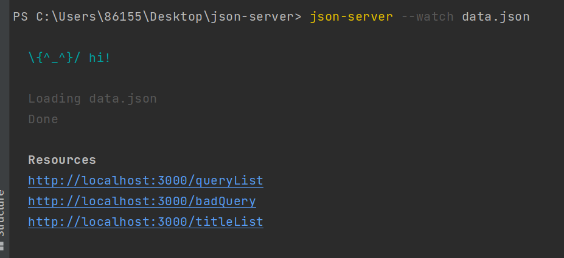<br>

#### 4.0 浏览器访问接口

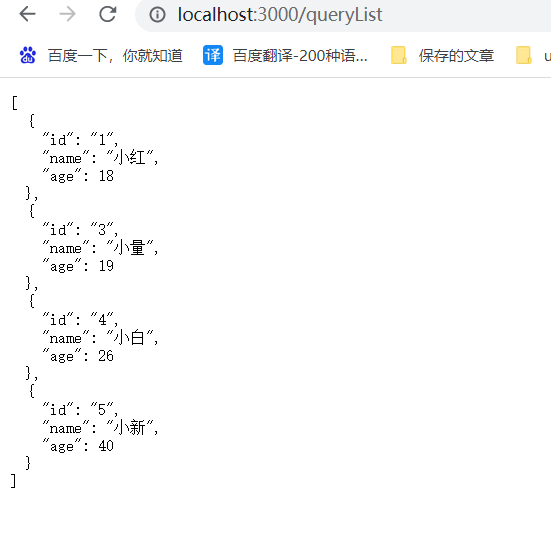<br>

#### 5.0 支持restful 风格的api
> 所谓的restful 风格就是通过不同的请求方式 对数据进行增删改查等不同的操作

 get：表示检索
 post: 表示新增操作
 delete：删除操作
 put: 修改操作
 patch：修改操作
#### 6.0 检索一条数据

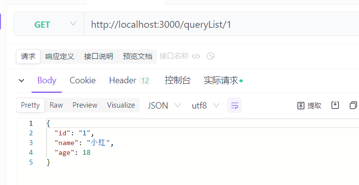<br>

#### 7.0 检索多条数据

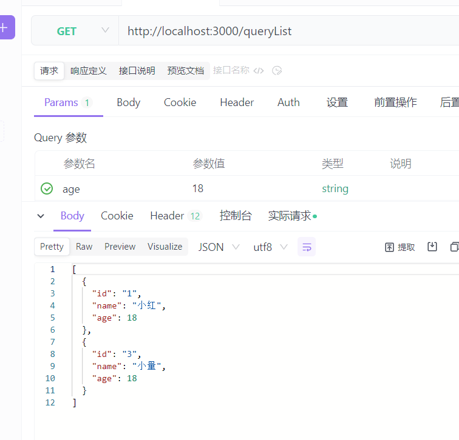<br>

#### 8.0 新增一条数据

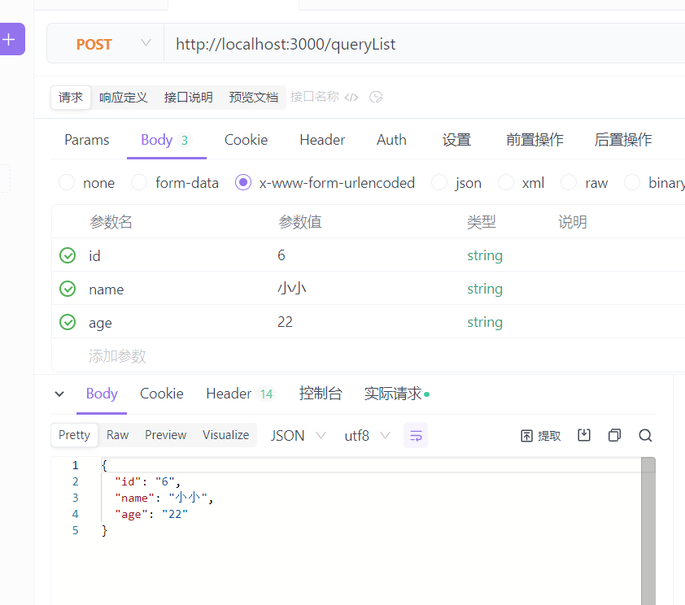<br>

我们再 data.json 文件里面就会多一条数据

#### 9.0 删除一条数据

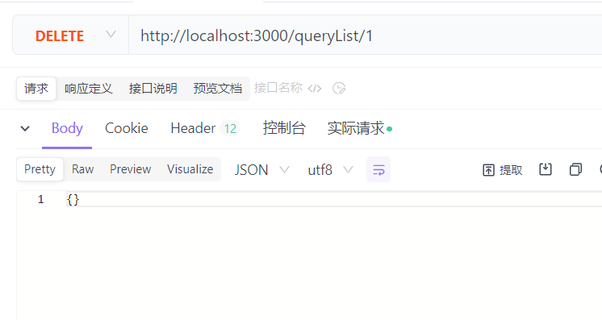<br>

我们的 data.json 文件里面就会少一条数据

#### 10.0 put修改一条数据

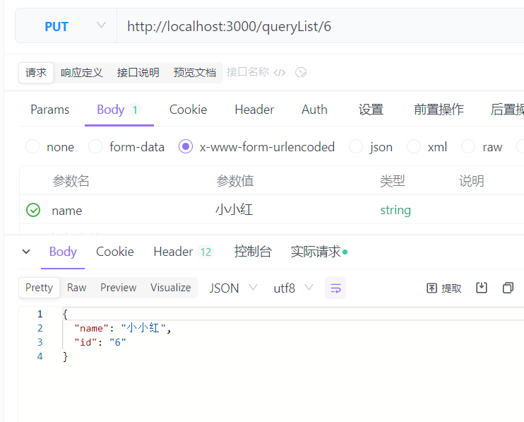<br>

** 注意：** 我们只修改了 name 但是我们数据里面 age没有了。

#### 11.0 path修改一条数据

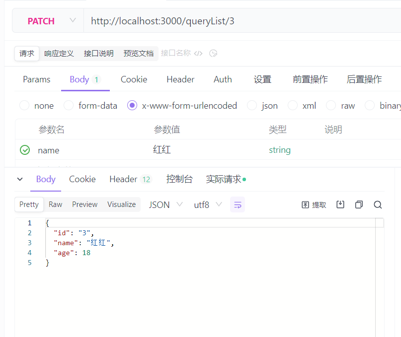<br>

** 注意：** 我们只修改了 name 但是我们数据里面 age还在。

### 12.0 分页请求
>?_page=2&_limit=2

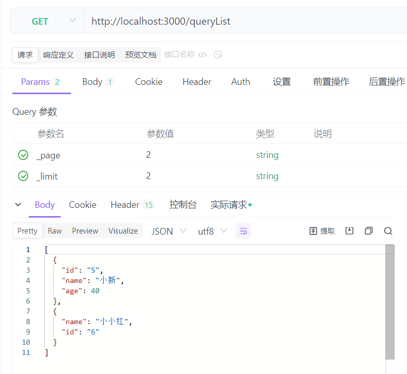<br>


### 13.0 关联上级数据
先修改 data.json
```angular2html
   "queryList": [
      {
       "id": "3",
       "name": "红红",
       "age": 18,
       "classId": "1"
      },
      {
       "id": "4",
       "name": "小白",
       "age": 26,
       "classId": "1"
      },
      {
       "id": "5",
       "name": "小新",
       "age": 40,
       "classId": "2"
      },
      {
       "name": "小小红",
       "id": "6",
       "classId": "2"
      }
     ],
     "classes": [
      {
       "id": "1",
       "title": "web班级",
       "queryListId": ["3","4"]
      },
      {
       "id": "2",
       "title": "java班级",
       "queryListId": ["5","6"]
      }
     ],
 }
```
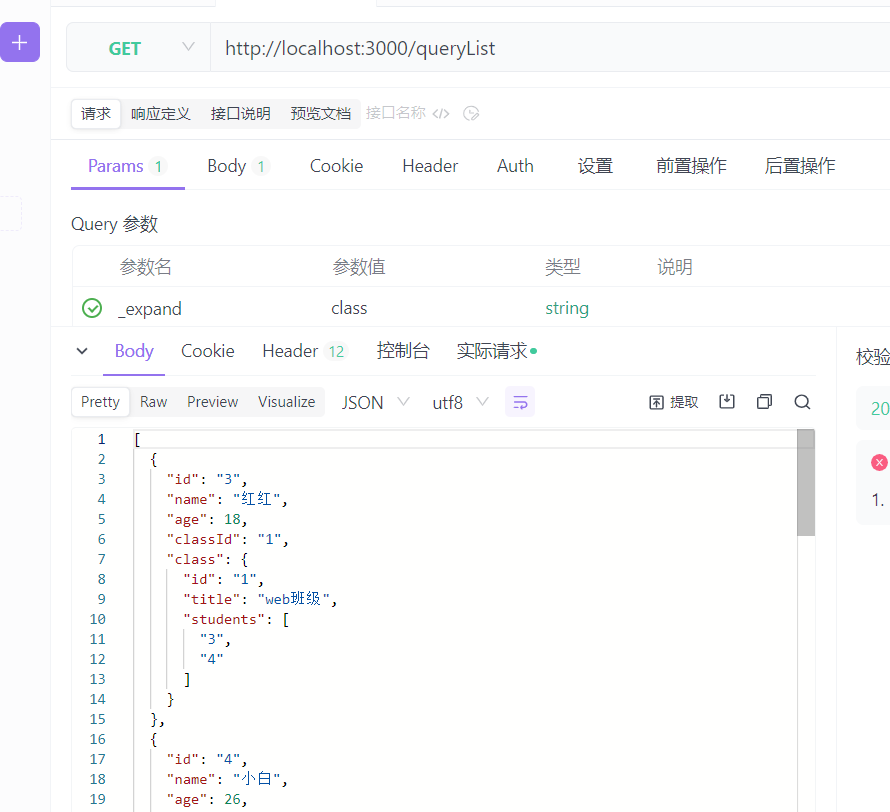<br>

**注意：** 参数：_expand，参数值是class 可不是classes

### 14.0 关联下级数据

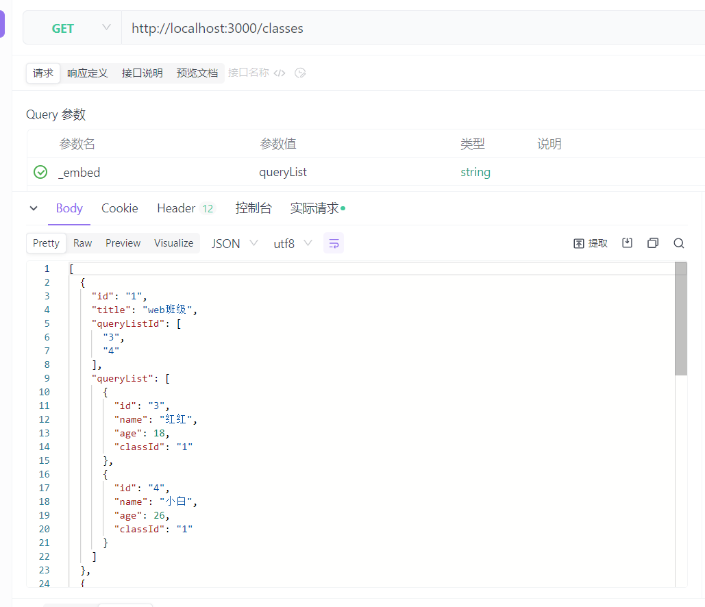<br>

**注意：** 参数：_embed，参数值是queryList 可不是queryListId

### 15.0 替换端口

>json-server --watch data.json --port 3004

[参考链接](https://www.npmjs.com/package/json-server) ：https://www.npmjs.com/package/json-server
<br>
每天都是一个起点，每天都有一点进步，每天都有一点收获
