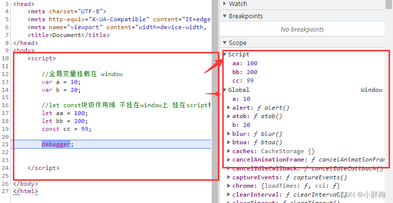

## 5.0 js变量提升

>任何声明在某个作用域内的变量，都将附属于这个作用域。但是作用域同其中的变量声明出现的位置有某种微妙的联系。这就涉及到JavaScript中的一个很重要的特性：变量提升。

直觉上会认为JavaScript代码在执行上是一行一行从上往下执行的。但是有一种特殊情况会导致这种假设是错误的。
<br>

栗子：
```angular2html
    a = 2;
    var a;
    console.log(a);
```
结果为：2

```angular2html
    console.log(a);
    var a = 2;
```
结果为：undefined <br>

为什么会出现这种情况？

答案是：**编译器**，在js代码执行之前编译器会进行编译。编译中的一部分工作就是找到所有的声明，并用合适的作用域将它们关联起来。因此，正确的思路是，包括变量和函数在内的声明都会在代码被执行前首先被处理。
<br>

所以，我们用编译器的角度来分析下第一段代码，可以重写为：
```angular2html
    var a;
    a = 2;
    console.log(2); // 2

```
再看第二段代码，等价为：
```angular2html
    var a;
    console.log(a);
    a = 2;
```

**注意：** 如果在函数中定义变量时没有指定 var 关键字，那么这个变量会自动提升为全局作用域的变量。

同理，函数声明会被提升，函数表达式却不会提升。比如：
```angular2html
    console.log(foo); // foo函数
    console.log(test); // undefined
    function foo() {
        console.log('foo');
    }
    
    var test = function() {
        console.log('test');
    }
```
函数声明和变量声明都会被提升，但是需要注意的是，函数会首先被提升，然后才是变量 **（函数是第一共公民🙂）** 。

```angular2html
    console.log(foo); // foo函数
    var foo = 'test';
    function foo() {
        console.log('foo');
    }
```
尽管变量foo的声明在函数foo的声明之前，但是因为函数声明会首先被提升，所以先声明了foo函数，当遇到变量foo的声明时，因为已经有了声明，所以重复的声明会被编译器忽略掉。所以上面的代码在编译器视角是这样子的：
<br>

```angular2html
    function foo() {
        console.log('foo');
    }
    var foo; // 重复声明，被忽略
    console.log(foo); // 函数foo

```
**注意：** 虽然重复的var声明会被忽略，但是出现在后面的函数声明还是可以覆盖前面的声明的。
```angular2html
    function foo(){
        console.log(123)
    }
    console.log(foo()) // 456
    function foo(){
        console.log(456)
    }
```
#### LET、CONST 以及 VAR 的区别是什么?
1.0 其是否会挂载到window上

> var声明的变量会挂载在window上，而let和const声明的变量不会挂载到window上，它形成了一个块作用域

2.0 是否存在变量提升
> var声明变量存在变量提升，let和const不存在变量提升

3.0 是否形成块作用域
let和const声明形成块作用域，var变量提升不会形成作用域

4.0 同一作用域下是否可以重复声明

>同一作用域下let和const不允许重复声明，否则会报错，而var可以

5.0 是否可以修改

>var和let可以可以修改声明的变量，const不可以。

6.0 暂时性死区

>let 和 const 定义的变量在定义之前调用，会抛出错误(形成了暂时性死区)，而 var 不会。

7.0 是否一旦声明，必须立即初始化赋值

>var 和 let 声明的时候可以不初始化赋值，const声明时必须赋值。

**经典面试题**
```js
 var arr = [];
 for (var i = 0; i < 3; i++) {
     arr[i] = function () {
         console.log(i);
     };
 }
 arr[0](); // 3
//因为i 是全局变量 然而 arr 里面存的都是 function(){ console.log(i) } // 所以打印的都是3

//怎么解决呢？
for (var i = 0; i < 3; i++) {
    arr[i] = (function(i){
        return function() {
            console.log(i);
        }
    }(i))
}
arr[0](); // 0

//用es6的方法解决
for (let i = 0; i < 3; i++) {
    arr[i] = function () {
        console.log(i);
    };
}
arr[0](); // 0
```

#### 全局作用域中，用CONST和LET声明的变量去哪了
    
1.0 在ES5中，全局变量直接挂载到全局对象window的属性上，所以能在window上看到var和function声明的全局变量
```js
var a = 10;
function f(){};
 
console.log(window.a); // 10
console.log(window.f); // f(){}
```
2.0 在ES6中，全局变量从全局对象WINDOW中脱离，但是为了保持兼容性，旧的不变，所以VAR、FUNCTION声明的全局变量依然可以在WINDOW对象上看到，而LET、CONST声明的全局变量在WINDOW对象上看不到，在SCRIPT中形成了一个块级作用域，这样在全局就可以访问到
```angular2html
let a = 1;
const B = 2;
 
console.log(window.a); // undefined
console.log(window.B); // undefined
console.log(a);     // 1,  通过块作用域访问到的
console.log(B);   // 2， 通过块作用域访问到的
```
通过设置断点，看看浏览器是怎么处理的
<br>

通过上图也可以看到，在全局作用域中，用 let 和 const 声明的全局变量并没有在全局对象中，只是一个块级作用域（Script）中。
<br>
那要怎么获取呢？在定义变量的块级作用域中就能获取

#### const 定义的常量不可修改，定义的对象可以修改为什么？
>const实际上保证的，并不是变量的值不得改动，而是变量指向的那个内存地址所保存的数据不得改动。

1.0 对于**基本类型**的数据（数值、字符串、布尔值），**值就保存在变量指向的那个内存地址**，因此等同于常量。

2.0 对于**引用类型**的数据（主要是对象和数组），**变量指向的内存地址，保存的只是一个指向实际数据的指针**，const只能保证这个指针是固定的（即总是指向另一个固定的地址），至于它指向的数据结构是不是可变的，就完全不能控制了

**Tips**: Object.freeze()

Object.freeze() 方法可以冻结一个对象。一个被冻结的对象再也不能被修改；冻结了一个对象则不能向这个对象添加新的属性，不能删除已有属性，不能修改该对象已有属性的可枚举性、可配置性、可写性，以及不能修改已有属性的值。此外，冻结一个对象后该对象的原型也不能被修改。freeze() 返回和传入的参数相同的对象。
```js
let nobj = Object.freeze(obj)
```
<hr>
人生总是在前行，不论走到哪里，只要带着信念往前走，比别人多一点努力，你就会多一份成绩；比别人多一点志气，你就会多一份出息；比别人多一点坚持，你就会夺取胜利；比别人多一点执着，你就会创造奇迹。
