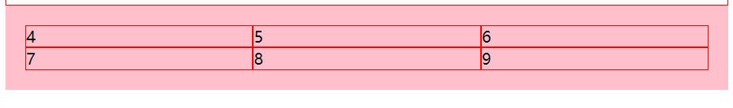

## 网格布局
实际情况就是我从来没用过网格布局，一直用的flex布局,闲来无事那我们就来学习一下吧！<br>
网格布局是最强大的布局，所以就有一点点难度了。
> CSS 网格布局模块（CSS Grid Layout Module）提供了带有行和列的基于网格的布局系统

**如图**
`<br>`
换句话说网格也就是由行和列组成的。
## 1.0 先尝尝鲜
看如下样式
```
<style>
.a{
    border:1px solid red;
}
.b{
    display: grid;
}
.qq{
    display: inline-grid;
}
</style>
<div >
    <div class="a">1</div>
    <div class="a">2</div>
    <div class="a">3</div>
</div>
<div class="b">
    <div class="a qq">4</div>
    <div class="a qq">5</div>
    <div class="a qq">6</div>
</div>
```
结果啥都没有改变
<br>
所以接下来怎么办呢，有一个这么的属性控制网格的列数：<br>
grid-template-columns<br>
这样设置值，比如三列：
>grid-template-columns：auto auto auto;

也可以指定大小
>grid-template-columns：100px 60px auto;

四列的话就是：
>grid-template-columns：auto auto auto auto;

所以我们修改一下css
```
.b{
    display: grid;
    grid-template-columns:auto auto auto;
}
```

我们再多加几个div试试，分别加2个和3个，结果如下：


我们要让这网格外面留点空间
```
.b{
    display: grid;
    grid-template-columns:auto auto auto;
    padding:20px;
    background: pink;
}
```

我们要 第一行的高度是100px;第二行的高度是200px;
``` 
.b{
    grid-template-rows:100px 200px;
}

```

我们要第一列占比百分之50%，剩下两列各25%，可以这样
```
.b{
    grid-template-columns:2fr 1fr 1fr;
}
网格引入了 fr 单位来帮助我们创建灵活的网格轨道。一个 fr 单位代表网格容器中可用空间的一等份。
```


那我们要网格之间有点间隙呢
```
.qq{
    margin-right: 10px;
    margin-bottom: 10px;
}
这种方法也是ok的但是有一点点问题就是 最有一个也有margin空间就会略微打那么一丢丢
人家也提供了
grid-row-gap:10px;// 设置网格布局中行之间的间隙大小
grid-column-gap:20px; // 设置网格布局中列之间的间隙大小
简写：grid-gap: 20px 50px; // 20 是行 50是列 
还可以：grid-gap: 20px;// 行列都是20
class 加上这两行或者一行也行
.b{
    grid-row-gap:10px;
    grid-column-gap:20px;
 }
```


这基本的网格结果就出现了。
## 2.0 合并单元格
网格布局嘛，就像我们使用的excel表格一样，很重要的一步就是合并单元格了。<br>
网格元素设置时可以参考这些行号。<br>
下图则定义了四条纵向的网格线，以及四条横向的网格线：<br>

网格线的编号顺序取决于文章的书写模式。在从左至右书写的语言中，编号为 1 的网格线位于最左边。在从右至左书写的语言中，编号为 1 的网格线位于最右边。
<br>
接下来我使用了 grid-column-start, grid-column-end, grid-row-start 和 grid-row-end 属性来演示如何使用网格线。
``` 
1.0 grid-column-start 指定网格元素列的开始位置
2.0 grid-column-end   指定网格元素列的结束位置
<div class="a qq item1">4</div>
.item1{
    grid-column-start: 1;
    grid-column-end: 3;
}
```

```
1.0 grid-row-start 指定网格元素行的开始位置
2.0 grid-row-end   指定网格元素行的结束位置
 .item1{
    grid-row-start: 1;
    grid-row-end: 3;
}
```

既合并行也合并列
```
.item1{
    grid-column-start: 1;
    grid-column-end: 3;
    grid-row-start: 1;
    grid-row-end: 3;
}
```


最后我们完成最开始的那个布局
```
<div class="a">
    <div class="item item1">头部</div>
    <div class="item item2">菜单</div>
    <div class="item">主要内容区域</div>
    <div class="item">右侧</div>
    <div class="item item5">底部</div>
</div>
.a{
    display: grid;
    grid-template-columns:1fr 6fr 4fr;
    grid-template-rows:50px 50px 50px;
    padding:20px;
    grid-row-gap:10px;
    grid-column-gap:20px;
    background: honeydew;
}
.item{
    color:#333;
    border:1px solid #333333;
    text-align: center;
    line-height: 50px;
}
.item1{
    grid-column-start: 1;
    grid-column-end: 4;
}
.item2{
    grid-row-start: 2;
    grid-row-end: 4;
}
.item5{
    grid-column-start: 2;
    grid-column-end: 4;
}
```


车贵买不起车，不是车的问题，是你的问题<br>
你中意的人，不中意你，不是他/她的问题，是你的问题<br>
靓仔！！！ <br>
努力！奋斗！


