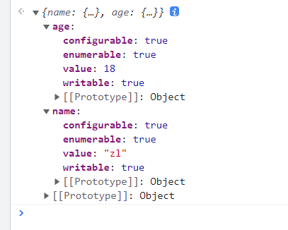

## es6+ 相关知识点

## 1.0 字符串填充
>str.padStart(),str.padEnd()方法可以使得字符串达到固定长度，接受两个参数
```js
let str = "reggie"
console.log(str.padStart(10,'x')) // reggiexxxx
console.log(str.padEnd(10,'x')) // xxxxreggie
console.log(str.padStart(5,'x')) // reggie
console.log(str.padStart(5,'x')) // reggie
```
用处：比如月份填充
```js
let list = []
for(let i = 1; i<13; i++){
    list.push((i+'').padStart(2,'0'))
}
```
## 2.0 对象方法的扩展
```js
let obj = {
    name:'zl',
    age:18
}
//es5 
console.log(Object.keys(obj)) // ['name', 'age']

// es8
console.log(Object.values(obj)) // ['zl', 18]
console.log(Object.entries(obj)) // [['name', 'zl'] ,['age', 18]]

console.log(Object.getOwnPropertyDescriptors(obj))
// 如下图
```


**对象丢三落四的复制**
```js
let obj = {
    name:'zz',
	age:18,
	get uppername(){
        return this.name.substring(0,1).toUpperCase() + this.name.substring(1)
	},
    set uppername(value){
      this.name = value  
	}
}
let obj1 = {}
Object.assign(obj1,obj)
console.log(obj1)
// {
//     age: 18,
//     name:"zz",
//     uppername:"Zz",
// }

```
**更好的复制**
```js
let obj = {
    name:'zz',
    age:18,
    get uppername(){
        return this.name.substring(0,1).toUpperCase() + this.name.substring(1)
    },
    set uppername(value){
        this.name = value
    }
}
let obj1 = {}
Object.defineProperties(obj1,Object.getOwnPropertyDescriptors(obj))
/*
* {
    name:'zz',
	age:18,
	uppername:"Zz",
	get uppername(){
        return this.name.substring(0,1).toUpperCase() + this.name.substring(1)
	},
    set uppername(value){
      this.name = value  
	}
}*/
```

## 3.0 剩余参数与扩展运算符
剩余参数
```js
let obj = {
    name:'zl',
    age:18,
    sex:'1'
}
let {name,...other} = obj
console.log(name) // zl
console.log(other) // { age:18,sex:'1'}

function test({name,...other}){
    console.log(name) // zl
    console.log(other) // { age:18,sex:'1'}
}
test(obj)
```
扩展运算符
```js
let obj1 = {
    name:1,
    sex:2
}
let obj2 ={
    name:3,
    age:18
}
let obj3 = {...obj1,...obj2}
console.log(obj3) // {name:3,sex:2,age:18}

// 用处 封装的时候可以用
function ajax(options){
    const defaultOptions = {
        url:'/user',
        methods:'get',
        async:true
    }
    options = {...defaultOptions,...options}
    console.log(options) // {url:'/rule',methods:'get',async:true}
}
ajax({url:'/rule'})

// 用处 浅复制
let obj4 = {name:'qq',sex:1}
let obj5 = {...obj4}
obj5.name = 'aa'
console.log(obj4) // {name:'qq',sex:1}
console.log(obj5) // {name:'aa',sex:1}
```

## 4.0 promise.finally

```js
    function test(){
        return new Promise((resolve,reject)=>{
          resolve()  
    })
}
test().then(res=>{
    
}).catch(err=>{
    
}).finally(()=>{
    console.log('我一定会执行的')
})
```

## 5.0 trimStart() 和 trimEnd()
> 用法和trimLeft 和 trimRight()一样
```js
let str = '   qqww  '
console.log(str.trimStart())//'qqww  '
console.log(str.trimEnd())//'   qqww'
```


## 6.0 Symbol 对象的descriptor属性
```js
let s = Symbol('name')
console.log(s.description) //name
```


## 7.0 Promise.allsettled
```js
// Promise.all 两个都必须成功 才进入.then
// Promise.race 哪个先成功哪个就进入.then
// Promise.allsettled 不管成功失败都走.then .then里面返回的结果，可以有有成功或者失败
Promise.allSettled([ajax('1.json'),ajax('2.json'),ajax('3.json')]).then(res=>{
    let data = res.filter(item=>item.status === 'fulfilled')
})
```


## 8.0 matchAll方法
```js
let str =`
    <ul>
        <li>11111</li>
        <li>222</li>
        <li>3333</li>
        <li>4444</li>
    </ul>
`
let reg = /<li>(?<content>.*)<\/li>/g // .任意字符  * 0到任意多个
// 收集li里面的内容
let match = null
let list = [];
while(match=reg.exec(str)){
    console.log(match,match)
    list.push(match.groups.content)
}
console.log(list) //['11111', '222', '3333', '4444']

// matchAll
let iobj = str.matchAll(reg)
for(let i of iobj){
    console.log(i.groups.content)
}

// ...展开运算符
console.log([...iobj])

```

## 9.0 globalThis
>globalThis 提供了一个标准的方式来获取不同环境下的全局this对象（也就是全局对象自身）

比如在浏览器中 globalThis 就是window<br>
在node环境中globalThis 就是global

## 10.0 空值合并运算符 ??
>但左侧是null或者undefined的时候取右边的值
```js
let a = null;
let b = "zz"
let c = a ?? b
console.log(c) // zz
let e = b ?? a
cosnole.log(e) // zz
let obj = {
    name:'zz'
}
let d = obj.age ?? b
cosnole.log(d) // zz
```
?? 与 || 的区别？

1. || 会对左侧的数据进行boolean类型转换，所以0和''转成false 显示右边的值
2. 而?? 不会进行转换，直接显示0或者''

## 11.0 可选链式操作符
```js
let user = {
    name:'zz',
    loaction:{
        city:'郑州'
    }
}
// 我们取值这样的
let city = user.location.city // 郑州
// 但是假设没有这个值呢
let user = {
    name:'zz'
}
let city = user && user.location && user.location.city
cosnole.log(city) // undefined

// 现在我们这样用
let city = user?.location?.city // 如果user存在就往后取location ，如果location不存在就返回undefeined如果存在继续往后取值
console.log(city) // undefined

// 结合上面的合并运算符
let city = user?.location?.city ?? '北京'
console.log(city) // 北京
```

## 12.0 数字分隔符 _
>目的就是为了让程序员直观点看数据
```js
let a = 1234566778
let b = 124_456_7778
console.log(a === b) // true
```
## 13.0 字符串的replaceAll方法
>所有匹配都会被替换，并返回一个全新的字符串
```js
let str = "今天 我去 今天 我拆 今天  耍耍"
let str1 = str.replaceAll('今天','明天')
console.log(str1) // 明天 我去 明天 我拆 明天  耍耍

let a = "15537000043"
let a1 = a.replaceAll('0','*')
console.log(a1)  // 15537****43
```


## 13.0 Promise.any
>只要任意一个fulfilled(成功) 就会走.then 全部失败才走.catch

## 14.0 FinalizationRegistry
>清理器注册表功能，用来指定目标对象被垃圾回收机制清楚以后，索要执行的回调函数
```js
let obj ={
    name:'zz'
}
const registry = new FinalizationRegistry(data=>{
    cosnole.log('销毁后我执行',data)
})
registry.register(obj,'1111')
registry.unregister(obj)
```


## 15.0 at函数
>at函数用来索引元素
```js
let arr = [1,2,'zz','ll']

// 之前写法
console.log(arr[0])// 1
console.log(arr[arr.length - 1]) // 倒数第一个
console.log(arr[arr.length - 1]) // 倒数第二个

// 现在
arr.at(0)
arr.at(-1) // 倒数第一个
arr.at(-2) // 倒数第二个
```

## 16.0 findeLast和findLastIndex
>findeLast()方法查找数组中符合条件的元素，(从后往前找)若有多个符合条件的元素，则返回第一个元素。
>findeLastIndex()方法查找数组中符合条件的元素下标，(从后往前找)
```js
let arr = [1,2,3,4,5]
let res = arr.findLast(value=>{
    console.log(value)
    return value>3 // 返回的元素
})
console.log(res) //5 

let res = arr.findLastIndex(value=>{ 
    return value<4 // 返回的元素下标
})
console.log(res) //2
```
