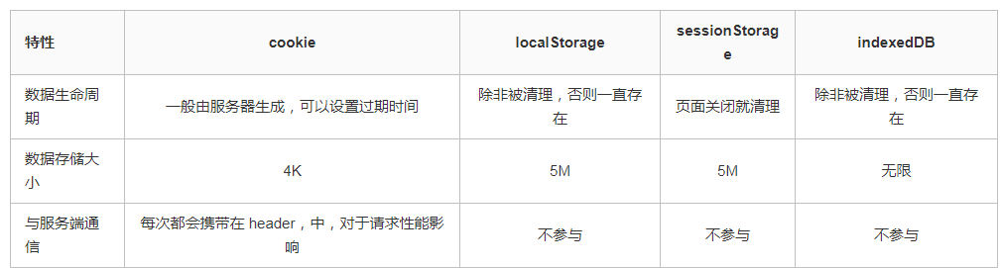

## 简介
HTML称为超文本标记语言，是一种标识性的语言

## 1.0 HTML语义化
 1. 语义化的含义就是用正确的标签做正确的事情 <br>
 2. html语义化就是让页面的**内容结构化，便于对浏览器、搜索引擎解析**；在没有样式CCS情况下也以一种文档格式显示，并且是容易阅读的<br>
 3. 搜索引擎的爬虫依赖于标记来确定上下文和各个关键字的权重，利于 **SEO(页面优化)**。<br>
 4. 使阅读源代码的人对网站更容易将网站分块，**便于阅读维护理解**。

## 2.0 Label 的作用是什么？是怎么用的？
label 标签来定义表单控制间的关系,**当用户选择该标签时，浏览器会自动将焦点转到和标签相关的表单控件上**。
```js
//两种用法：一种是 id 绑定，一种是嵌套
<label for="Name">Number:</label>

<input type=“text“name="Name" id="Name"/>

<label>Date:<input type="text" name="B"/></label>
```

## 3.0 DOCTYPE(⽂档类型) 的作⽤
DOCTYPE是HTML5中一种标准通用标记语言的文档类型声明，它的目的是**告诉浏览器（解析器）应该以什么样（html或xhtml）的文档类型定义来解析文档，** 不同的渲染模式会影响浏览器对 CSS 代码甚⾄ JavaScript 脚本的解析。
<br>
**注意：** 它必须声明在HTML⽂档的第⼀⾏。
<br>
浏览器渲染页面的两种模式（可通过document.compatMode获取）：
1. **标准模式（Strick mode）**，默认模式，浏览器使用W3C的标准解析渲染页面。在标准模式中，浏览器以其支持的最高标准呈现页面。
2. **怪异模式(混杂模式)(Quick mode)**，浏览器使用自己的怪异模式解析渲染页面。在怪异模式中，页面以一种比较宽松的向后兼容的方式显示。

## 4.0 meta标签
>用来描述网页文档的属性，比如网页的作者，网页描述，关键词等

``` html
<!DOCTYPE html>  H5标准声明，使用 HTML5 doctype，不区分大小写
<head lang=”en”> 标准的 lang 属性写法
<meta charset=’utf-8′>    声明文档使用的字符编码
<meta http-equiv=”X-UA-Compatible” content=”IE=edge,chrome=1″/>   优先使用 IE 最新版本和 Chrome
<meta name=”description” content=”不超过150个字符”/>       页面描述
<meta name=”keywords” content=””/>      页面关键词
<meta name=”author” content=”name, email@gmail.com”/>    网页作者
<meta name=”robots” content=”index,follow”/>      搜索引擎抓取
<meta name=”viewport” content=”initial-scale=1, maximum-scale=3, minimum-scale=1, user-scalable=no”> 为移动设备添加 viewport
<meta name=”apple-mobile-web-app-title” content=”标题”> iOS 设备 begin
<meta name=”apple-mobile-web-app-capable” content=”yes”/>  添加到主屏后的标题（iOS 6 新增）
是否启用 WebApp 全屏模式，删除苹果默认的工具栏和菜单栏
<meta name=”apple-itunes-app” content=”app-id=myAppStoreID, affiliate-data=myAffiliateData, app-argument=myURL”>
添加智能 App 广告条 Smart App Banner（iOS 6+ Safari）
<meta name=”apple-mobile-web-app-status-bar-style” content=”black”/>
<meta name=”format-detection” content=”telphone=no, email=no”/>  设置苹果工具栏颜色
<meta name=”renderer” content=”webkit”>  启用360浏览器的极速模式(webkit)
<meta http-equiv=”X-UA-Compatible” content=”IE=edge”>     避免IE使用兼容模式
<meta http-equiv=”Cache-Control” content=”no-siteapp” />    不让百度转码
<meta name=”HandheldFriendly” content=”true”>     针对手持设备优化，主要是针对一些老的不识别viewport的浏览器，比如黑莓
<meta name=”MobileOptimized” content=”320″>   微软的老式浏览器
<meta name=”screen-orientation” content=”portrait”>   uc强制竖屏
<meta name=”x5-orientation” content=”portrait”>    QQ强制竖屏
<meta name=”full-screen” content=”yes”>              UC强制全屏
<meta name=”x5-fullscreen” content=”true”>       QQ强制全屏
<meta name=”browsermode” content=”application”>   UC应用模式
<meta name=”x5-page-mode” content=”app”>    QQ应用模式
<meta name=”msapplication-tap-highlight” content=”no”>    windows phone 点击无高光
设置页面不缓存
<meta http-equiv=”pragma” content=”no-cache”>
<meta http-equiv=”cache-control” content=”no-cache”>
<meta http-equiv=”expires” content=”0″>
```

viewport是专为手机浏览器设计的一个meta标签
* initial-scale：初始缩放比例
* maximum-scale：允许缩放的最大比例
* minimum-scale：允许缩放的最小比例
* user-scalable：是否允许手动缩放

## 5.0 如何关闭表单自动填充
**描述**
<br>
默认情况下，浏览器会记录用户网页上提交的 \<input\> 框的信息。这使得浏览器能够提供自动补全（在用户开始输入的时候给用户提供可能的内容）和自动填充（在加载的时候预先填充某些字段）功能
<br>
然而，一些数据可能会在将来失效（例如一次性密码）或包含敏感信息（例如唯一的政府身份识别码或信用卡安全码）。作为网站作者，你可能更希望浏览器不去记住这些字段的值，即使浏览器的自动填充功能已开启
```html
<form  autocomplete="off"></form>
<input type="text" id="cc" name="cc" autocomplete="off">
```
## 6.0 b 与 strong 的区别、i 与 em 的区别？
1. **b 与 strong 的区别**
  * b这个标签对应 bold，即文本加粗，其目的仅仅是为了加粗显示文本，是一种样式／风格需求；
  * strong这个标签意思是加强字符的语气，表示该文本比较重要，提醒读者／终端注意。为了达到这个目的，浏览器等终端将其加粗显示；

2. **i 与 em 的区别**
  * i为了斜体而斜体
  * em为了标明重点而斜体

对于搜索引擎来说**strong和em**-----比b和i要重视的多


## 7.0 src 和 href 的区别
href**标识超文本引用**， 用在 link和a元素上面,href是引用和页面关联，是在当前元素和引用资源之间建立联系。 <br>
src表示**引用资源*，表示替换当前元素，用在img，script，iframe上，src是页面内容不可缺少的一部分。<br>
src是source的缩写，是指向外部资源的位置，指向的内部会迁入到文档中当前标签所在的位置；在请求src资源时会将其指向的资源下载并应用到当前文档中，例如js脚本，img图片和frame等元素。<br>
当浏览器解析到这一句的时候会暂停其他资源的下载和处理，直至将该资源加载，编译，执行完毕，图片和框架等元素也是如此，类似于该元素所指向的资源嵌套如当前标签内，这也是为什么要把js饭再底部而不是头部。

## 8.0 为什么用多个域名存储网站资源更有效？
1、CDN 缓存更方便

2、突破浏览器并发限制

3、节约 cookie 带宽

4、节约主域名的连接数，优化页面响应速度

5、防止不必要的安全问题

## 9.0 渐进增强和优雅降级之间的区别
**渐进增强（progressive enhancement）**：主要是针对低版本的浏览器进行页面重构，保证基本的功能情况下，再针对高级浏览器进行效果，交互等方面的改进和追加功能，以达到更好的用户体验。
<br>
**优雅降级 (graceful degradation)**： 一开始就构建完整的功能，然后再针对低版本的浏览器进行兼容。

## 10.0 img 上 title 与 alt
title 指图片的信息、alt 指图片不显示时显示的文字

## 11.0 异步加载js的两种方法defer和async
为什么要异步加载JS<br>
同步加载JS：将`<script>`脚本放在`<head>`标签内，不使用defer和async。
这时浏览器碰到`<script>`标签会立即加载并执行指定的脚本，
“立即”指的是在渲染 `<script>` 标签之下的文档元素之前，也就是说不再渲染后续的文档元素，
直到`<script>`之内的元素加载并执行完毕。这样会造成 “空白页” 出现，给用户带来很不友好的体验，所以就出现了异步加载JS的办法；
<br>

异步加载JS：异步是相对于HTML解析来说的。即在加载`<script>`脚本的同时继续加载并渲染后续的HTML元素，即并行进行，该过程为异步加载JS；
<br>
将`<script>`脚本放在`</body>`标签之前
<br>
注意，这并不是真正意义上的异步加载JS，而是利用HTML从上到下执行代码的特性，最后执行`<script>`脚本
<br>
但是，这是最佳实践。因为对于旧浏览器来说这是唯一的优化选择，此法可保证非脚本的其它一切元素能够以最快的速度加载并解析。
<br>
异步加载JS有哪些方法
``` 
1、使用defer

　　<script defer src="demo1.js"></script>
　　<script defer src="demo2.js"></script>
　　demo1.js 和 demo2.js 将和后续文档元素的加载同时进行（加载并不等于执行）；

　　demo1.js 和 demo2.js 的执行是在所有元素渲染完成之后，DOMContentLoaded事件触发之前完成；

　　demo1.js 和 demo2.js 会按照顺序执行，即先执行 demo1.js，再执行 demo2.js（因为demo1.js 在 demo2.js 之前）；

　　注意：当脚本都加载完成后才会按照顺序执行

　　适用：当脚本之间有相互依赖时非常合适

3、使用async

<script async src="demo3.js"></script>
<script async src="demo4.js"></script>
　　demo3.js 和 demo4.js 将和后续文档元素的加载同时进行（加载并不等于执行）；

　　demo3.js 和 demo4.js 并不保证执行顺序，谁先加载完成谁先执行。即同一个js文件的执行紧挨着加载的，加载完毕就执行

　　demo3.js 和 demo4.js 可能在DOMContentLoaded事件之前执行，比如当HTML元素特别多时

　　也可能在DOMContentLoaded事件之后执行，比如当HTML元素特别少时

　　适用：对于那些可以不依赖任何脚本或不被任何脚本依赖的脚本来说却是非常合适的
```

## 12.0 浏览器解析HTML方式
```
 有三种解析方式:
     1.0 非怪异（标准）模式 // 页面按照 HTML 与 CSS 的定义渲染
     2.0 怪异模式 // 中则尝试模拟更旧的浏览器的行为
     3.0 部分怪异（近乎标准）模式 // 实施了一种表单元格尺寸的怪异行为，除此之外符合标准定义
```
> 一个不含任何 DOCTYPE 的网页将会以 怪异(quirks) 模式渲染。

DOCTYPE它的目的:是要告诉标准通用标记语言解析器，它应该使用什么样的文档类型定义（DTD）来解析文档<br>
``HTML5提供的<DOCTYPE html>是标准模式，向后兼容的, 等同于开启了标准模式，那么浏览器就得老老实实的按照W3C的 标准解析渲染页面，这样一来，你的页面在所有的浏览器里显示的就都是一个样子了。
``
## 13.0 DOM结构
>DOM: Document Object Module, 文档对象模型。我们通过JavaScript操作页面的元素，进行添加、移动、改变或移除的方法和属性, 都是DOM提供的。

**DOM节点**<br>
根据 W3C 的 HTML DOM 标准，HTML 文档中的所有内容都是节点：<br>
1. 整个文档是一个文档节点
2. 每个 HTML 元素是元素节点
3. HTML 元素内的文本是文本节点
4. 每个 HTML 属性是属性节点
5. 注释是注释节点<br>

**HTML DOM 节点树**<br>
>HTML文本会被解析为DOM树, 树中的所有节点均可通过 JavaScript 进行访问。所有 HTML 元素（节点）均可被修改，也可以创建或删除节点。

**节点的关系**<br>
父（parent）、子（child）和同胞（sibling）等术语用于描述这些关系。父节点拥有子节点。同级的子节点被称为同胞（兄弟或姐妹）:<br>
* 在节点树中，顶端节点被称为根（root）
* 每个节点都有父节点、除了根（它没有父节点）
* 一个节点可拥有任意数量的子
* 同胞是拥有相同父节点的节点

## 14.0 HTML5新增内容
>HTML5 是对 HTML 标准的第五次修订。其主要的目标是将互联网语义化，以便更好地被人类和机器阅读，并同时提供更好地支持各种媒体的嵌入。HTML5 的语法是向后兼容的。

**与HTML 4的不同之处**
* 文件类型声明（<!DOCTYPE>）仅有一型：<!DOCTYPE HTML>。
* 新的解析顺序：不再基于SGML。
* 新的元素：section, video, progress, nav, meter, time, aside, canvas, command, datalist, details, embed, figcaption, figure, footer, header, hgroup, keygen, mark, output, rp, rt, ruby, source, summary, wbr。
```
<article> 定义文档内的文章。
<footer>	定义文档或节的页脚。
<header>	定义文档或节的页眉。
<main>	定义文档的主内容。
<nav>	定义文档内的导航链接。 
```
*  input元素的新类型：date, email, url等等。
* 新的属性：ping（用于a与area）, charset（用于meta）, async（用于script）。
*  全域属性：id, tabindex, repeat。
*  新的全域属性： contextmenu, draggable, dropzone, hidden, spellcheck。
*  移除元素：acronym, applet, basefont, big, center, dir, font, frame, frameset, isindex, noframes, strike, tt。

<br>

**新增标签**
<br>
```
HTML 5提供了一些新的元素和属性，反映典型的现代用法网站。其中有些是技术上类似<div>和<span>标签，但有一定含义，例如<nav>（网站导航块）和<footer></footer><audio></audio>和<video></video>标记。
```

**新应用程序接口（API）**
<br>

除了原先的DOM接口，HTML5增加了更多样化的API:<br>
* HTML Geolocation
* HTML Drag and Drop
* HTML Local Storage
* HTML Application Cache
* HTML Web Workers
* HTML SSE
* HTML Canvas/WebGL
* HTML Audio/Video

## 15.0 cookie 和session 的区别
cookie 机制是通过检查客户身上的“通行证”来确定客户身份的话，那么 session 机制就是通过检查服务器上的“客户明细表”来确认客户身份。
<br>
session 相当于程序在服务器上建立的一份客户档案，客户来访的时候只需要查询客户档案表就可以了。
<br>

**1.0 存在的位置**
<br>
cookie 存在于客户端;session 存在于服务器的内存中

**2.0 安全性**
<br>
cookie 是以明文的方式存放在客户端的，安全性低，；session 存放于服务器的内存中，所以安全性好

**3.0 生命周期(以 20 分钟为例)**
<br>
cookie 的生命周期是累计的，从创建时，就开始计时，20 分钟后 cookie 生命周期结束；<br>
session 的生命周期是间隔的，从创建时，开始计时如在 20 分钟，没有访问 session，那么 session 生命周期被销毁。<br>
但是，如果在 20 分钟内（如在第 19 分钟时）访问过 session，那么，将重新计算 session 的生命周期。<br>
关机会造成 session 生命周期的结束，但是对 cookie 没有影响

**4.0 访问范围**
<br>
cookie 为多个用户浏览器共享；session 为一个用户浏览器独享

## 16.0 localStorage和sessionStorage的异同

**1、生命周期：**
<br>
**localStorage** 的生命周期是永久的，关闭页面或浏览器之后localStorage中的数据也不会消失。localStorage除非主动删除数据，否则数据永远不会消失。
<br>
**sessionStorage** 的生命周期是在仅在当前会话下有效。sessionStorage引入了一个“浏览器窗口”的概念，sessionStorage是在同源的窗口中始终存在的数据。只要这个浏览器窗口没有关闭，即使刷新页面或者进入同源另一个页面，数据依然存在。但是sessionStorage在关闭了浏览器窗口后就会被销毁。

**2、存储大小：**
<br>
localStorage和sessionStorage的存储数据大小一般都是：5MB

**3、存储位置：**
<br>
localStorage和sessionStorage都保存在客户端，不与服务器进行交互通信。

**4、存储内容类型：**
<br>
localStorage和sessionStorage只能存储字符串类型，对于复杂的对象可以使用ECMAScript提供的JSON对象的stringify和parse来处理

**5、获取方式：**
<br>
window.localStorage;；window.sessionStorage;。

**6、应用场景：**
<br>
**localStoragese** ：常用于长期登录（+判断用户是否已登录），适合长期保存在本地的数据。
**sessionStorage** ：敏感账号一次性登录；

**注意：sessionStorage**
<br>
之前一直以为，同一个窗口，只要会话还没有过期，不同标签页之间，相同域名下的sessionStorage是一样的。

正确答案：刷新当前页面，或者通过location.href、window.open、或者通过带target="_blank"的a标签打开新标签，之前的sessionStorage还在， 但是如果你是主动打开一个新窗口或者新标签，对不起，打开F12你会发现，sessionStorage空空如也。

也就是说，sessionStorage的session仅限当前标签页或者当前标签页打开的新标签页，通过其它方式新开的窗口或标签不认为是同一个session。

大家可以亲自测试一下，手动打开的新标签和点A标签打开的新标签效果完全不一样。

**WebStorage相比cookie的优点：**

1.0 存储空间更大：cookie为4KB，而WebStorage是5MB；
<br>
2.0 节省网络流量：WebStorage不会传送到服务器，存储在本地的数据可以直接获取，也不会像cookie一样美词请求都会传送到服务器，所以减少了客户端和服务器端的交互，节省了网络流量；
<br>
3.0 对于那种只需要在用户浏览一组页面期间保存而关闭浏览器后就可以丢弃的数据，sessionStorage会非常方便；
<br>
4.0 快速显示：有的数据存储在WebStorage上，再加上浏览器本身的缓存。获取数据时可以从本地获取会比从服务器端获取快得多，所以速度更快；
<br>
5.0 安全性：WebStorage不会随着HTTP header发送到服务器端，所以安全性相对于cookie来说比较高一些，不会担心截获，但是仍然存在伪造问题；
<br>


**浏览器存储的方式有哪些**

<br>
IndexedDB是一个文档数据库，它在完全内置于浏览器中的一个沙盒环境中（强制依照（浏览器）同源策略）。
<br>区别： <br>
1.0 生命周期的不同 <br>
2.0 数据量的大小不同<br>
3.0 cookie 主要是跟服务器通信的<br>

localStorage 只能存字符串，存取 JSON 数据需配合 JSON.stringify() 和 JSON.parse()


## 17.0 html 几个有意思的标签
```
1.0 table 合并边框
table,tr,td{
    border:1px solid blue;
    border-collapse:collapse;
}
2.0 合并单元格 
行：colspan="2"
列：rowspan = "2"
3.0 <dl> 标签定义一个描述列表。
<dl> 标签与 <dt> （定义项目/名字）和 <dd> （描述每一个项目/名字）一起使用。
<table>
		<thead>
			<td>1</td>
			<td>2</td>
		</thead>
		<tbody>
			<tr>
				<td colspan="2">1</td>
				<td>2</td>
			</tr>
			<tr>
				<td rowspan="2">1</td>
				<td>2</td>
			</tr>
			<tr>
				<td >1</td>
				<td>2</td>
			</tr>
		</tbody>
		<tfoot>
			<tr>
				<td >1</td>
				<td>2</td>
			</tr>
		</tfoot>
	</table>

	<dl>
	  <dt>Coffee</dt>
	  	<dd>Black hot drink</dd>
	  <dt>Milk</dt>
	  	<dd>White cold drink</dd>
	</dl> 
```


## 18.0新标签兼容低版本
引入html5shiv.js


