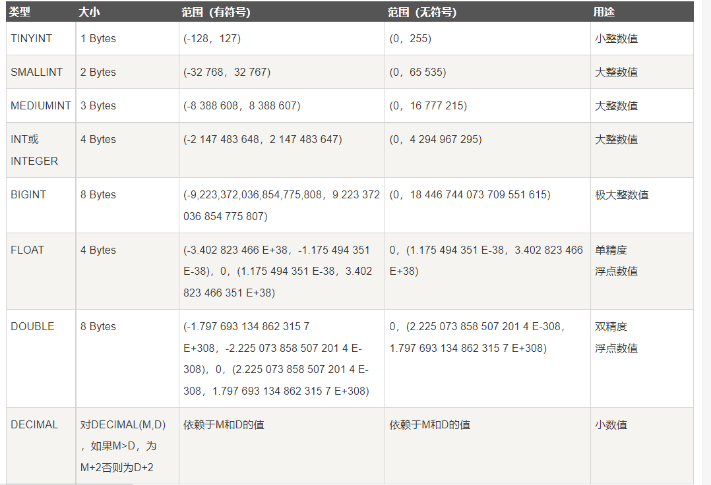
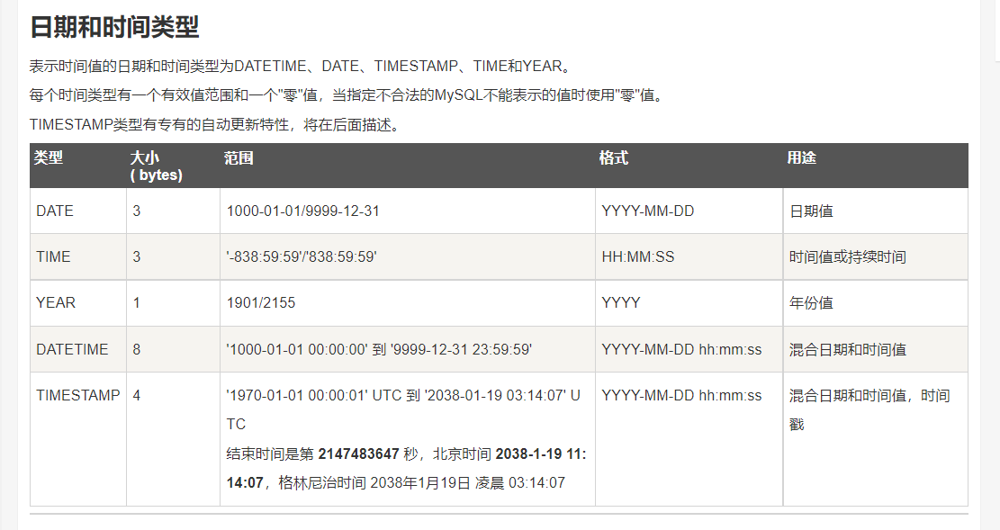
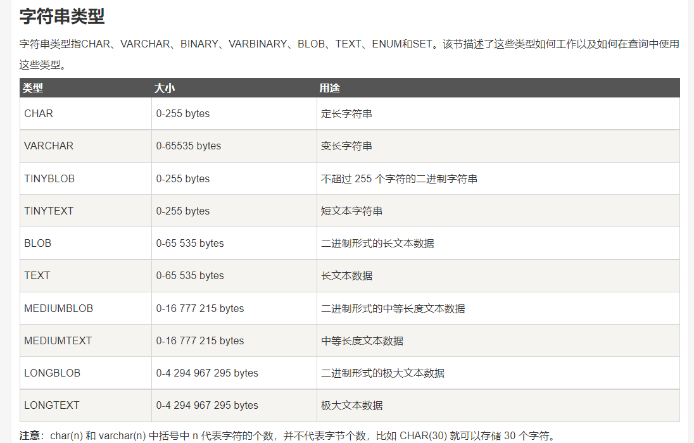

## mysql 常用数据类型有哪些？
大致可以分为三类：数值、日期/时间和字符串(字符)类型。

**一个汉字占用几个字节**
ASCII码:一个中文(含繁体)占两个字节,一个中文标点占三个字节。一个英文字符占一个字节的,一个英文标点占一个字节。
UTF-8编码:一个中文(含繁体)占三个字节,一个中文标点占三个字节。一个英文字符占一个字节,一个英文标点占一个字节。
Unicode编码:一个中文(含繁体)占两个字节,一个中文标点占两个字节。一个英文字符占两个字节,一个英文标点占一个字节。

其主要度量单位是字节，1个字节（Byte）等于8位（b）二进制。 1字节大小(-128,127)
数值类型

数据类型如何选择

1. 日期选择按照格式
2. 数值和字符串按照大小

