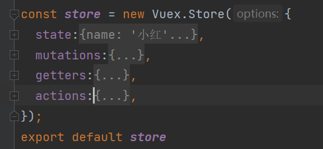

## Vuex实战
Vuex 是一个专为 Vue.js 应用程序开发的状态管理模式。它采用集中式存储管理应用的所有组件的状态，并以相应的规则保证状态以一种可预测的方式发生变化。
<br>英译：
> dispatch 派遣;调遣;派出;发出，发送 <br>
> state 状态<br>
> actions 行动 所做之事<br>
> mutations 变异，突变<br>
> commit 承诺，保证(做某事、遵守协议或遵从安排等)<br>
> payload 有效载荷 装载量<br>

## 1.0 安装
npm install vuex --save<br>
注意版本，我第一次安装的时候版本就过高导致出错，后来就删除了，从新装了一下npm install vuex@2.0 --save

## 2.0 创建文件
在src文件夹下创建 store文件，然后创建index.js 里面内容如下
```
import Vue from 'vue'
import Vuex from 'vuex'
Vue.use(Vuex);

const store = new Vuex.Store({
  state:{
    count:1
  },
  mutations:{
    increment(state){
      state.count++
    }
  }
});
export default store 
```
再然后在 main.js里面引入
```
import Vue from 'vue'
import App from './App'
import router from './router'
import ElementUI from 'element-ui';
import 'element-ui/lib/theme-chalk/index.css';
import store from './store/index'
Vue.use(ElementUI);
Vue.config.productionTip = false

new Vue({
  el: '#app',
  router,
  store,
  components: { App },
  template: '<App/>'
})
```
## 3.0  简单使用
你可以通过 store.state 来获取状态对象，以及通过 store.commit 方法触发状态变更：
```
<div class="hello">
    <div>{{num}}</div>
    <el-button type="primary" @click="look()">点我看看</el-button>
</div>
data () {
    return {
      msg: 'Welcome to Your Vue.js App',
      num:null,
    }
  },
  created(){
    console.log(this.$store)
    this.num = this.$store.state.count;
  },
  methods:{
      look(){
        this.$store.commit('increment')
        console.log(this.$store.state)
        this.num = this.$store.state.count; // 注意 改变之后得赋值要不然怎么取到呢，得从新取一下
      },
  },
```
每点击一次就能加1，大家可以试一试。<br>
上面步骤略显繁琐，那我们直接放在计算属性里面
```
data () {
    return {
      msg: 'Welcome to Your Vue.js App',
      // num:null,
    }
  },
computed:{
    num(){ // 放在计算属性 data里面的 num 是需要删除的
      return this.$store.state.count
    }
},
created(){
},
methods:{
  look(){
    this.$store.commit('increment')
  },
},
```
当然了 每次都 this.$store.state.xxx 不符合我们程序员的 “懒散”，上
``` 
import { mapState } from 'vuex';
computed: {
    ...mapState(['count']), 
},
如果你指写上面的话，我们的程序指定有问题，因为我们渲染的值是num
所以就需要该名字了，
computed: {
    ...mapState({num:'count'}), 
},
```
## 4.0 Getter修饰器
比如我们上面的count，需要我们在前面全部加一个字符串“hello”，当然我们在页面就可以直接加，但是如果页面很多，我们就要修改很多次，
如果要把“hello”，变成“fuck”了，我们又要去多个页面修改。所有就出现了Getter这个修饰器。
```
const store = new Vuex.Store({
  state:{
    count:1,
    name:'小红'
  },
  mutations:{
    increment(state){
      state.count++
    }
  },
  getters:{
    getCount(state){
      return 'hello '+state.count
    },
  }
});
// 每次获取的时候
created(){
    console.log(this.$store.getters.getCount) // hello 1
},
// 当然这样太多字了
用mapGetters去结构
import {mapState,mapGetters} from 'vuex'
computed:{
    ...mapState({num:'count'}), //
    ...mapGetters(['getCount']) // 注意用的时候名字 就叫 ‘getCount’
}, 
当然 我们可以修改它的名
...mapGetters({ otherCount: 'getCount' }) // 页面这样用就可以了{{otherCount}}
```
## 5.0 了解如何修改值：Mutation
更改 Vuex 的 store 中的状态的唯一方法是提交 mutation。<br>
我们上面已经用过mutation了，下面讲mutation的进阶，传参，这跟我们函数传参一样一样的
```
mutations:{
    increment(state,n){
      state.count += n  
    }
}, 
页面方法
look(){
    this.$store.commit('increment',2) // 每次都加2 触发一次变成3 再触发变成5 然后7
},
但是呢 参数这边官方建议传递一个对象，而不是一个值，这样更美观，其实我觉的是后面人看代码更好理解
mutations:{
    increment(state,payload){
      state.count += payload.number
    }
},
页面方法
look(){
    this.$store.commit('increment',{number:666}) //每次都加666
},
当然也有对应的 mapMutations 但是我个人建议不用
```
## 6.0 了解一步操作 Actions
在 mutation 中混合异步调用会导致你的程序很难调试。例如，当你调用了两个包含异步回调的 mutation 来改变状态，你怎么知道什么时候回调和哪个先回调呢？这就是为什么我们要区分这两个概念。在 Vuex 中，mutation 都是同步事务：
<br> 修改store/index.js
``` 
const store = new Vuex.Store({
  state:{
    count:1,
    name:'小红'
  },
  mutations:{
    increment(state,payload){
      state.count += payload.number
    }
  },
  getters:{
    getCount(state){
      return 'hello '+state.count
    },
  },
  actions:{
      setNum(content){ // content 默认参数 与 store 实例具有相同方法和属性
        return new Promise((resolve,reject)=>{
          setTimeout(()=>{
            content.commit('increment',{number:100})
            resolve()
          },1000)
        })
      }
  },
});
export default store

async created(){
    console.log('旧值:',this.$store.state.count) //  1
    await this.$store.dispatch('setNum');
    console.log('新值:',this.$store.state.count) // 101
},
```
看了例子，是不是明白了，action就是去提交mutation的，什么异步操作都在action中消化了，最后再去提交mutation的。<br>
简化写法
```
actions 稍作修改
actions:{
      setNum(content,payLoad){
        return new Promise((resolve,reject)=>{
          setTimeout(()=>{
            content.commit('increment',{number:payLoad.number})
            resolve()
          },1000)
        })
      }
  },
  页面修改如下
import { mapActions } from 'vuex';
 async created(){
    await this.setNum({ number: 101 })
    console.log(this.$store.state.count) //102
  },
  methods:{
    ...mapActions(['setNum']),
  },
  当然我们也可以 修改这个名字
  ...mapActions({ OthersetNum: 'setNum' }), // 调用this.OthersetNum()
```
看到这里，你应该明白action在vuex的位置了吧，什么时候该用action，什么时候不用它，你肯定有了自己的判断，最主要的判断条件就是我要做的操作是不是异步，这也是action存在的本质。当然，你不要将action和mutation混为一谈，action其实就是mutation的上一级，在action这里处理完异步的一些操作后，后面的修改state就交给mutation去做了
## 7.0 项目结构
我们目前就这一个index.js 假设如果我们这个页面内容很多很多，那以后看起来或者维护起来就麻烦了，所以我们把这个页面拆分一下
<br>
index.js里面大致包含state/getters/mutations/actions这四个属性，我们可以彻底点，index.js里面就保持这个架子，把里面的内容四散到其他文件中。
<br>
state.js
```
export const state = {
  count:1,
  name:'小红'
}
```
getters.js
``` 
export const getters = {
    getCount(state){
    return 'hello '+state.count
  },
}
```
mutations.js
``` 
export const mutations = {
  increment(state,payload){
    state.count += payload.number
  }
}
```
actions.js
``` 
export const actions =  {
  setNum(content,payLoad){
    return new Promise((resolve,reject)=>{
      setTimeout(()=>{
        content.commit('increment',{number:payLoad.number})
        resolve()
      },1000)
    })
  }
}
```
最后我们的index.js
``` 
import Vue from 'vue'
import Vuex from 'vuex'
import {state} from './state'
import {getters} from "./getters";
import {mutations} from "./mutations";
import {actions} from "./actions";

Vue.use(Vuex);

const store = new Vuex.Store({
  state:state,
  getters:getters,
  mutations:mutations,
  actions:actions
});
export default store
```
以上就是简单的进行了按属性进行拆分store里面的代码，这样就比较清晰了哈，你需要加什么就去哪里加，大家各干各的，互不影响。<br>
当然，你完全可以不这么做，引用官方文档中的一句话，“需要多人协作的大型项目中，这会很有帮助。但如果你不喜欢，你完全可以不这样做”。
<br>
## 总结
以上就是vuex的基本操作了，希望大家学以致用。
<br>参考链接
>https://vuex.vuejs.org/zh/installation.html<br>
>https://juejin.cn/post/6928468842377117709

你要克服懒惰，你要克服游手好闲，你要克服漫长的白日梦，你要克服一蹴而就的妄想，你要克服自以为是浅薄的幽默感。你要独立生长在这世上，不寻找不依靠，因为冷漠寡情的人孤独一生。你要坚强，振作，自立，不能软弱，逃避，害怕。不要沉溺在消极负面得情绪里，要正面阳光得对待生活和爱你的人。


